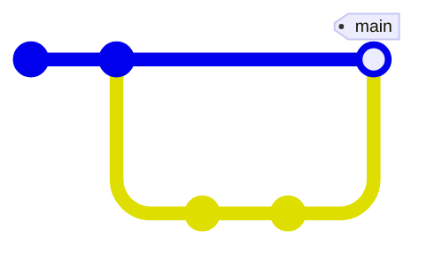
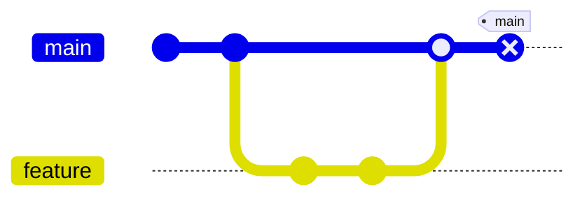
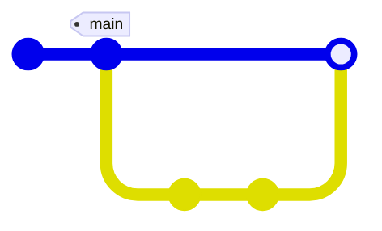

In Git you have branches and tags.
Pogo has bookmarks.

Git uses tags for marking versions like `v1.0.0` or `1.0.0-alpha01` and branches for continuously changing work (like `main`, `dev`, or `staging`).
In Pogo, these are the same thing.
Both is a name that points to a change.

After you merged your feature with main, you can update the `main` bookmark to point to the merge commit.

Let's say the feature was badly tested, it has some critical bugs and you need to roll back this merge.
In Git you would have to create a new revert commit that reverts the merge commit.

In Pogo you can simply set the `main` bookmark back to before the merge.
You can continue fixing and update `main` later.

The `main` bookmark is a special bookmark that is treated like the default branch in Git.

You can add any other bookmarks you want.
Use them for marking continuous work like `dev` or `staging`.
Use them for marking versions like `v1.0.0` or `1.0.0-alpha01`.
