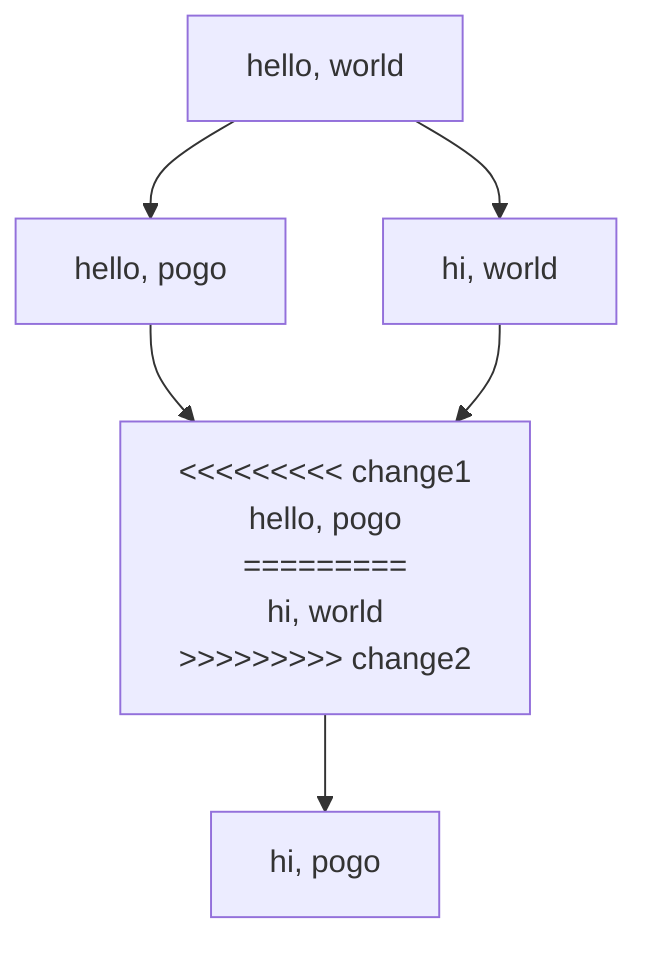
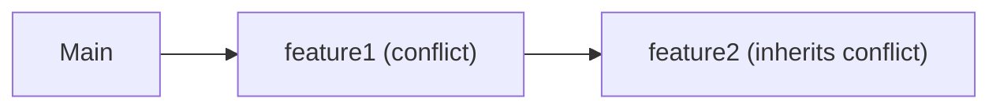

Pogo treats conflicts as first-class citizens, allowing you to push conflicted changes and resolve them when convenient. This approach reduces merge anxiety and enables more flexible collaboration.

## Philosophy

Traditional decentralized version control systems block progress when conflicts occur. Pogo takes a different approach:

- **Push with conflicts**: Continue working even with unresolved conflicts
- **Defer resolution**: Resolve conflicts when you have time and context
- **Collaborate on conflicts**: Others can help resolve conflicts
- **Clear tracking**: Always know what conflicts exist

## How Conflicts Occur

Conflicts happen when:

1. Two changes modify the same part of a text file differently
2. One change deletes a file another modifies
3. Binary files are changed in both parent changes
4. Directory structure changes conflict

### Example Scenario



Merging change1 and change2 creates a conflict.

This conflict can be resolved in the same or a new change.
In this example, a new change is created, baset on the merge. The conflict is resolved in this new change.

The conflict is still stored in the history.

## Conflict Markers

Pogo uses standard conflict markers in text files:

```
<<<<<<<<< change1
hello, pogo
=========
hi, world change2
>>>>>>>>> B
```

### Marker Components

- `<<<<<<<<<`: Start of first change, followed by the name of the change
- `=========` Separator between changes
- `>>>>>>>>>`: Start of second change, followed by the name of the change

Log shows 💥 if there are conflicts in a change:

```ansi
$ pogo log
  ●   KPHRpdJnwyPcLH4a
  │   hi, pogo
  ○   DKJbFrEkyhLpnCm3 💥
  │   merge
○─┤   RJcALPmeLceea4hL
│ │   hello, pogo
│ ╰─○ wEpaCJnAELNrDFyk
│   │ hi, world
╰─○─╯ hfEJKLREKxhDfK4b
      hello, world
```

The merge `DKJbFrEkyhLpnCm3` contains the conflict markers:

```
<<<<<<<<< RJcALPmeLceea4hL
hello, pogo
=========
hi, world
>>>>>>>>> wEpaCJnAELNrDFyk
```

## Conflict Types

### Text File Conflicts

Text merge can be performed on any unicode text file (UTF-8, UTF-16 LE, UTF-16 BE, UTF-32 LE, UTF-32 BE). On conflict you will get the Git conflict markers you are used to.

### Binary File Conflicts

When binary files conflict, You will get all of the files. They are renamed to signal the conflict and where each file came from.

### Semantic Conflicts

Code that doesn't conflict textually but breaks:

- Function signature changes
- Incompatible logic changes
- No automatic detection
- Requires testing to find

Pogo doesn't notice semantic conflicts, you will need other ways to find them.

## Best Practices

### Prevention

**Communicate Changes**

- Describe changes clearly
- Coordinate on shared files
- Push frequently

**Modular Code**

- Small, focused files
- Clear separation of concerns
- Minimal overlap between features

### During Conflicts

**Don't Panic**

- Conflicts are normal
- Take time to understand
- Ask for help if needed: collaborative merging

**Understand Context**

- Read both versions fully
- Understand the intent
- Consider the bigger picture

**Test After Resolution**

- Ensure code still works
- Run test suite
- Check for semantic conflicts

### Team Workflows

**Conflict Owner**

- Person who creates merge owns resolution
- Can delegate to subject expert
- Documents resolution reasoning

### Cascading Conflicts

Conflicts can propagate:



### Conflict Recovery

If resolution goes wrong:

```bash
# Revert to pre-resolution state
pogo edit previous-change

# Start fresh
pogo new

# Try different resolution
```

## Next Steps

- Learn [Basic workflows](/guides/basic-workflow)
- Understand [Changes](/concepts/changes)
- Explore [Bookmarks](/concepts/bookmarks)
- See [Commands reference](/reference/commands)
