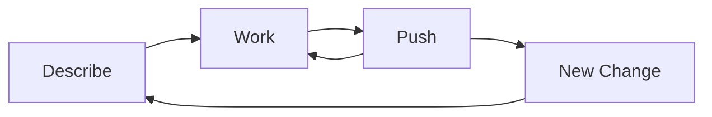

This guide covers the essential Pogo workflows you'll use in daily development.

## The Pogo Workflow

The core Pogo workflow is simple and iterative:



## Starting a New Project

### Initialize Repository

```bash
# Create project directory
mkdir my-project
cd my-project

# Initialize Pogo repository
pogo init --name my-project --server pogo.company.com:8080

# Enter your personal access token if prompted
```

### First Change

```bash
# Describe what you're building
pogo describe

# Create initial files
echo "# My Project" > README.md
mkdir src tests docs
echo "console.log('Hello');" > src/index.js

# Push your work
pogo push

# Set main bookmark
pogo bookmark set main
```

## Daily Development

### Morning Routine

```bash
# View recent history
pogo log

# Start new work based on main
pogo new main
```

### Feature Development

```bash
# 1. Describe your intent
pogo describe

# 2. Implement incrementally
nvim src/auth/login.js
pogo push  # Save progress

nvim src/auth/session.js
pogo push  # Save more progress

# 3. Update description if scope changes
pogo describe

# 4. Finalize when complete
pogo push
pogo new   # Start next change
```

## Next Steps

- Learn about [Server setup](/guides/server-setup)
- Understand [Authentication](/guides/authentication)
- Explore [Advanced workflows](/guides/advanced-workflows)
- See [Command reference](/reference/commands)
